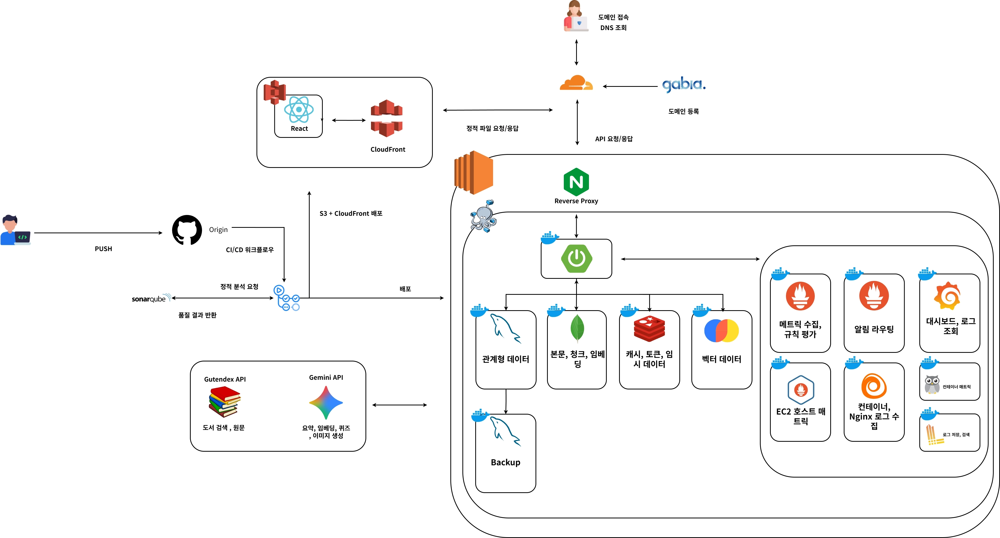
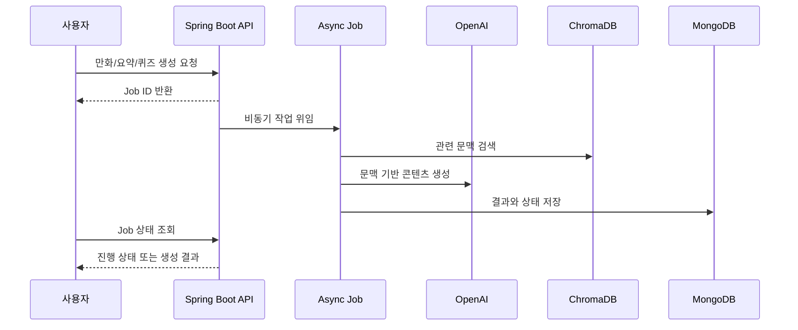
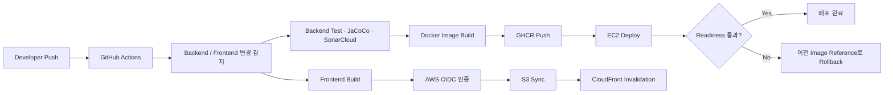

# BookTown V2

> 고전 문학 원문을 수집하고 OpenAI 기반으로 만화·요약·퀴즈를 생성하여 독서 경험으로 연결한 풀스택 서비스입니다.


## 💻 Tech Stacks

| 구분 | 기술 |
| --- | --- |
| Backend | Java 21, Spring Boot 4.0.6, Spring MVC, Spring Security, Spring Data JPA/MongoDB/Redis |
| AI | Spring AI 2.0.0-M6, OpenAI Chat/Embedding/Image, ChromaDB RAG |
| Frontend | React 19.2, TypeScript 6, Vite 8, React Router 7, TanStack Query 5, Axios, Tailwind CSS 4 |
| Data | MySQL 8.4, MongoDB, Redis 7.4, ChromaDB 1.0 |
| Infrastructure | Docker Compose, Nginx, Amazon EC2, S3, CloudFront, Route 53 |
| Observability | Prometheus, Grafana, Loki, Grafana Alloy, Micrometer |
| CI/CD | GitHub Actions, GHCR, AWS OIDC, S3 Sync, CloudFront Invalidation |
| Test | JUnit 5, Spring Boot Test, Testcontainers, Vitest, k6, JaCoCo, SonarCloud |

## 🏗️ System Architecture



### AI 콘텐츠 생성 흐름



관계형 데이터, 긴 원문/생성 콘텐츠, 단기 상태, 임베딩 벡터를 각각 MySQL·MongoDB·Redis·ChromaDB에 배치했습니다. AI 호출은 HTTP 요청 수명과 분리된 비동기 Job으로 실행하며, 클라이언트는 Job ID로 상태를 조회합니다.

## 🚀 CI/CD Pipeline



- 백엔드는 테스트와 정적 분석을 통과한 이미지만 GHCR에 푸시합니다.
- EC2 배포 직전 현재 실행 이미지의 정확한 reference를 보존하고, readiness 실패 시 해당 이미지로 되돌리도록 구성했습니다.
- 프론트엔드는 장기 AWS Access Key 없이 GitHub OIDC로 인증해 S3에 동기화하고 CloudFront 캐시를 무효화합니다.
- Compose와 Prometheus 설정, k6 스크립트도 워크플로에서 구문 검증합니다.

> 자동 롤백 로직은 워크플로에 구현되어 있습니다. 의도적인 장애 주입과 실제 복원 로그를 이용한 런타임 검증은 아직 남아 있습니다.

### Validation Status

| 항목 | 상태 |
| --- | --- |
| Backend unit/integration test | GitHub Actions에서 자동 실행 |
| JaCoCo / SonarCloud | 품질 리포트 자동 생성 |
| Frontend build/test | Vite/Vitest 기반 검증 |
| Readiness | MySQL, Redis, MongoDB, ChromaDB 상태 확인 |
| k6 | 스크립트 구문과 스모크 시나리오 구성, 성능 수치 추가 측정 필요 |
| Rollback | 파이프라인 구현 완료, 장애 주입 기반 복원 증거 필요 |

## ✨ 주요 기능 (Key Features)

| 영역 | 주요 기능 |
| --- | --- |
| 도서 탐색 | Gutendex 검색과 도서 가져오기, 원문 열람, 도서 목록·상세·검색 |
| AI 요약 | 원문과 벡터 검색 문맥을 활용한 비동기 요약 생성, 작업 상태 조회 |
| AI 퀴즈 | 도서 기반 퀴즈 생성, 답안 제출과 결과 확인 |
| AI 만화 | 장면 기반 이미지 생성, 만화 작업 이력과 결과 조회 |
| 개인화 | 북마크, 독서 콘텐츠 관리, 사용자별 상태 제공 |
| 인증/보안 | JWT, OAuth2, HttpOnly Refresh Token, Redis Lua 원자적 토큰 회전, Turnstile |
| 운영 | MySQL·Redis·MongoDB·ChromaDB readiness, Micrometer 지표, 로그 수집 구성 |
| 관리자 | 도서/사용자/AI 작업 현황을 확인하는 관리자 대시보드 |

## 🛠️ Local Development

```powershell
Copy-Item .env.example .env
docker compose up -d --build
docker compose ps
```

백엔드와 프론트엔드를 개별 실행할 수도 있습니다.

```powershell
Set-Location BookTown-V2-Backend
./gradlew bootRun

Set-Location ../BookTown-V2-Frontend
npm ci
npm run dev
```

`OPENAI_API_KEY`, 데이터베이스 비밀번호, OAuth 자격증명 등 실제 Secret은 `.env` 또는 배포 환경에만 설정합니다.

## 📁 Repository Structure

```text
BookTown-V2/
├─ BookTown-V2-Backend/      # Spring Boot API와 AI 파이프라인
│  ├─ ops/                   # Nginx 등 EC2 운영 설정
│  ├─ monitoring/            # Prometheus, Grafana, Loki, Alloy
│  ├─ performance/           # k6 시나리오
│  └─ compose.yaml           # 로컬 애플리케이션과 인프라
├─ BookTown-V2-Frontend/     # React 사용자/관리자 화면
├─ docs/                     # 아키텍처와 운영 문서
└─ .github/workflows/        # CI/CD 워크플로
```
