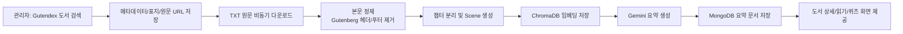
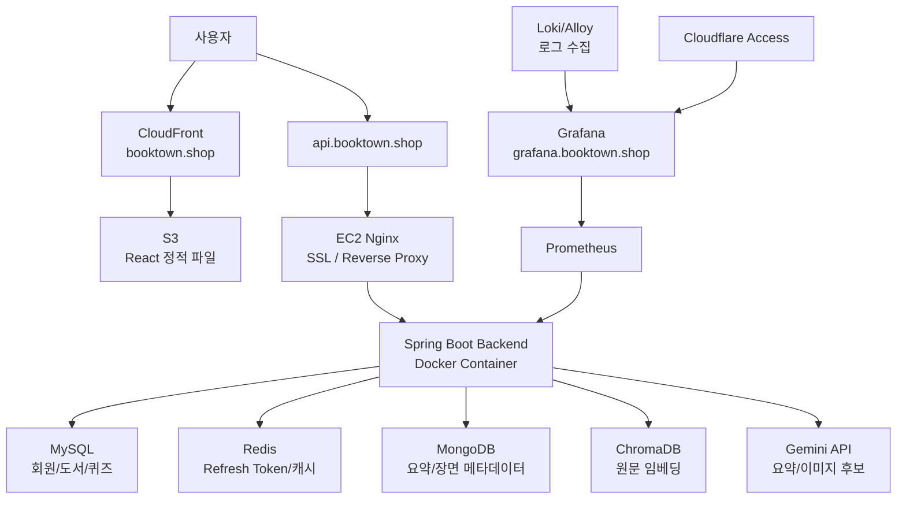
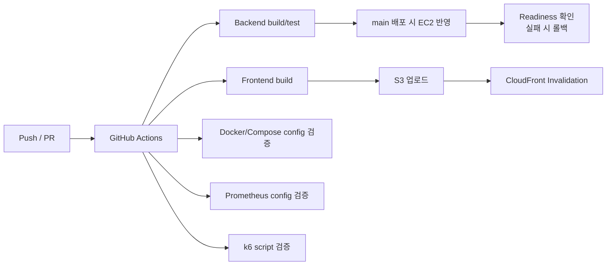

# BookTown V2

AI 기반 고전문학 인터랙티브 독서 플랫폼입니다.  
Gutendex에서 공개 도서를 가져오고, 원문을 정제한 뒤 Gemini 기반 요약과 독서 콘텐츠로 재가공합니다.

## 서비스 개요

| 항목 | 내용 |
|---|---|
| 서비스 | 책고을 BookTown |
| 목적 | 긴 고전문학 원문을 요약, 장면, 퀴즈로 쉽게 읽을 수 있게 재구성 |
| 프론트엔드 | React 19, TypeScript, Vite, Tailwind CSS 4, TanStack Query |
| 백엔드 | Java 21, Spring Boot 4, Spring Security, Spring Data JPA |
| 데이터 저장소 | MySQL, Redis, MongoDB, ChromaDB |
| AI | Gemini API, Spring AI, Vector Store 기반 RAG 구조 |
| 운영 | AWS EC2, S3, CloudFront, Nginx, Docker Compose |
| 관측/검증 | Prometheus, Grafana, Loki, k6, GitHub Actions |

## 적용된 핵심 기능

| 영역 | 구현 내용 |
|---|---|
| 도서 수집 | 관리자 페이지에서 Gutendex 검색 후 도서 메타데이터, 표지, 원문 URL 수집 |
| 원문 처리 | TXT 원문 비동기 다운로드, Project Gutenberg 상하단 문구 제거, 챕터 분리 |
| AI 재가공 | 제목/책 소개/요약을 한국어 독서용 문장으로 재가공 |
| 독서 화면 | 도서 상세에서 `지금 읽으러 가기`로 요약과 장면 기반 읽기 흐름 제공 |
| 퀴즈 | 도서 기반 퀴즈 생성, 제출, 결과 저장 |
| 관리자 | 도서 등록, 크롤링/파싱 Job 상태 확인, AI 표지/요약 생성 요청 |
| 인증/보안 | JWT, Refresh Token HttpOnly Cookie, Cloudflare Turnstile |
| 모니터링 | Actuator 메트릭을 Prometheus가 수집하고 Grafana 대시보드로 확인 |

## AI 도서 처리 파이프라인



현재 표지는 Gutendex 원본 커버를 기본으로 사용합니다. Gemini 이미지 생성은 quota와 비용을 고려해 관리자 선택 기능으로 분리했습니다.

## 배포 아키텍처



## CI/CD 흐름



## 운영 구성

| 구성 | 적용 내용 |
|---|---|
| Docker Compose | Backend, MySQL, Redis, MongoDB, ChromaDB, Prometheus, Grafana, Loki 구성 |
| Healthcheck | DB/캐시/문서 DB/벡터 DB 의존 서비스 상태 확인 |
| Readiness | 배포 후 `https://api.booktown.shop/api/v1/health/readiness` 확인 |
| Rollback | Readiness 실패 시 기존 이미지로 backend 컨테이너 재기동 |
| Monitoring | Prometheus가 Actuator `/actuator/prometheus` 수집 |
| Dashboard | Grafana provisioning으로 BookTown overview 대시보드 구성 |
| Load Smoke | k6로 health endpoint 응답성 검증 |
| Admin 보안 | Grafana는 Cloudflare Access로 외부 접근 보호 |

## 주요 API 흐름

| 기능 | 흐름 |
|---|---|
| 로그인/회원가입 | Frontend Turnstile token 발급 후 Backend 검증, JWT 발급 |
| 도서 가져오기 | `GET /admin/gutendex/books` 검색 후 `POST /admin/gutendex/books/{id}/import` |
| 콘텐츠 처리 | 원문 다운로드, 정제, 챕터/장면 생성 Job 실행 |
| 요약 생성 | 관리자 요청으로 Summary Job 생성, Gemini 처리 후 MongoDB 저장 |
| 읽기 | 도서 상세에서 요약/챕터/장면 정보를 조합해 읽기 화면 제공 |

## 로컬 실행 개요

```bash
# Backend
cd BookTown-V2-Backend
./gradlew bootRun

# Frontend
cd BookTown-V2-Frontend
npm install
npm run dev
```

의존 인프라가 필요할 때는 백엔드의 Docker Compose 구성을 사용합니다.

```bash
cd BookTown-V2-Backend
docker compose --profile app --profile monitoring up -d
```

실제 실행에는 DB, Redis, MongoDB, ChromaDB, Gemini API Key 환경변수가 필요합니다. 민감 정보는 저장소에 커밋하지 않습니다.

