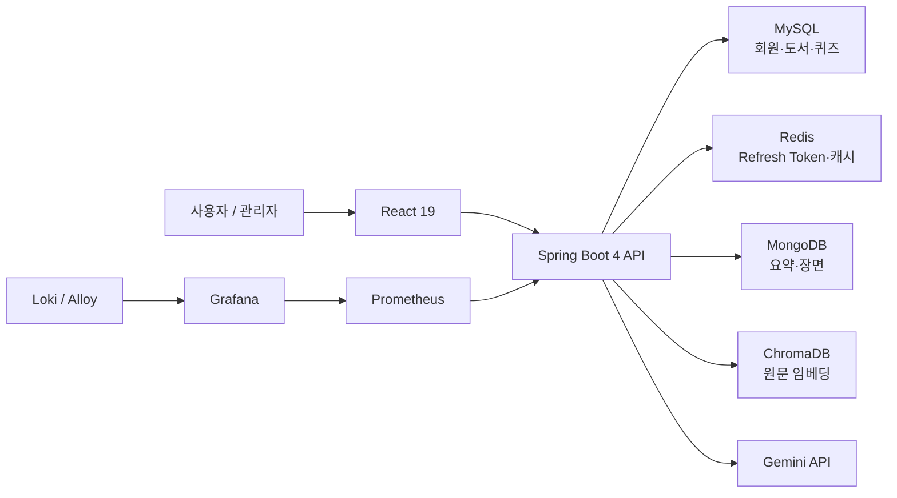
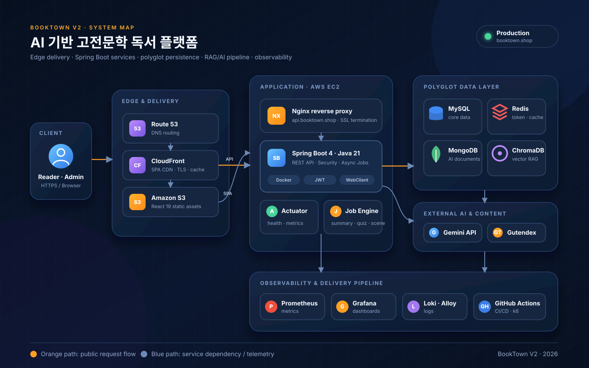
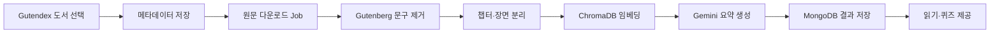
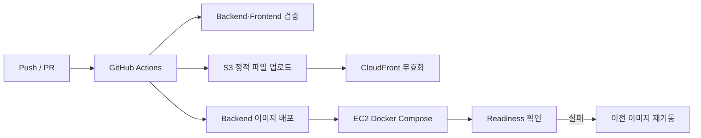

# BookTown V2

공개 고전문학을 수집해 한국어 요약, 장면, 퀴즈로 재구성하는 AI 독서 플랫폼입니다. 관리자 도서 수집부터 원문 정제, AI 콘텐츠 생성, 사용자 독서 경험, 운영 모니터링까지 하나의 서비스 흐름으로 구현했습니다.

> V1의 기능 구현 경험을 바탕으로 Java 21·Spring Boot 4·Spring AI 2 기반으로 다시 설계한 리팩터링 프로젝트입니다. 단순한 기술 교체보다 비동기 작업 상태, 트랜잭션 커밋 이후 처리, AI 장애 격리, 운영 가능한 배포 흐름을 명시하는 데 초점을 맞췄습니다.

## 핵심 기능

| 영역 | 구현 내용 |
|---|---|
| 도서 수집 | Gutendex 검색 결과에서 메타데이터, 표지, 원문 URL을 가져와 관리자가 등록 |
| 원문 처리 | TXT 비동기 다운로드, Project Gutenberg 헤더·푸터 제거, 챕터와 장면 분리 |
| AI 콘텐츠 | Gemini와 Spring AI를 이용한 한국어 소개·요약·퀴즈 생성 |
| 독서 경험 | 도서 상세, 장면 기반 읽기, 퀴즈 제출과 결과 저장 |
| 인증·보안 | JWT, HttpOnly Refresh Token 쿠키, Cloudflare Turnstile 검증 |
| 운영 | Docker Compose, GitHub Actions, Prometheus·Grafana·Loki, readiness 기반 배포 확인 |

## V1에서 V2로

| 구분 | V1 | V2 | 선택 이유 |
|---|---|---|---|
| 런타임 | Java 17 | Java 21 | 최신 LTS 기준으로 리팩터링하고 언어·런타임 개선 사항을 적용하기 위해 전환 |
| 애플리케이션 | Spring Boot 3.2.5 | Spring Boot 4.0.6 | 기존 기능을 복제하는 데 그치지 않고 최신 Spring 생태계에서 구조를 다시 검증 |
| AI 연동 | API별 직접 연동 | Spring AI 2.0.0-M6 + Gemini | 모델 호출과 프롬프트·벡터 저장소 연동의 경계를 일관되게 관리 |
| 처리 흐름 | 기능 중심 비동기 호출 | Job 상태 + 커밋 이후 실행 | 저장 전 비동기 작업이 먼저 시작되는 경쟁 조건을 줄이고 처리 상태를 추적 |
| 검색 보강 | 원문 중심 생성 | ChromaDB 기반 RAG + 원문 fallback | 검색 품질을 활용하되 벡터 저장소 장애가 전체 생성 실패로 번지지 않도록 격리 |
| 운영 | 애플리케이션 배포 중심 | Compose + 관측성 + readiness 확인 | 배포 이후 상태를 확인하고 장애 원인을 추적할 수 있는 운영 흐름을 경험하기 위해 적용 |

## 아키텍처



### 배포 아키텍처



Route 53은 서비스 도메인을 정적 웹과 API 엔드포인트에 연결합니다. React 정적 자산은 CloudFront와 S3에서 제공하고, API는 EC2의 Nginx를 거쳐 Spring Boot 컨테이너로 전달합니다. 애플리케이션은 데이터 성격에 따라 MySQL, Redis, MongoDB, ChromaDB를 사용하며 Gemini와 Gutendex를 외부 연동으로 분리합니다.

### AI 도서 처리 파이프라인



## 주요 설계 결정

### 1. Job 저장과 커밋 이후 비동기 실행

원문 다운로드와 요약 생성은 즉시 끝나지 않는 작업입니다. 요청 트랜잭션 안에서 Job을 먼저 저장하고, 커밋이 완료된 뒤 실제 처리를 실행하도록 분리해 작업 스레드가 아직 커밋되지 않은 Job을 조회하는 경쟁 조건을 줄였습니다. Job의 `PENDING`, `RUNNING`, `COMPLETED`, `FAILED` 상태로 관리자 화면에서 처리 결과를 추적합니다.

### 2. RAG 장애를 AI 생성 전체 장애와 분리

요약 생성 시 ChromaDB 검색 문맥을 활용하지만 검색에 실패하면 원문으로 계속 처리합니다. 외부 AI·벡터 저장소를 사용하는 경로에서 선택적 의존성 장애가 핵심 독서 콘텐츠 생성까지 중단시키지 않도록 한 결정입니다.

### 3. Redis Lua로 Refresh Token 원자 연산 구성

Refresh Token 회전 과정은 조회와 갱신 사이에 동시 요청이 끼어들 수 있습니다. Lua 스크립트 결과 코드를 기준으로 검증·교체·삭제가 한 번에 처리되도록 구성했습니다. 현재 저장소 근거는 코드와 단위 검증 범위이며, 실제 Redis를 사용한 동시성 통합 테스트는 후속 검증 항목입니다.

### 4. 조회 경로의 N+1 제어

도서 목록과 상세 조회에서 연관 데이터를 무조건 순회하지 않도록 fetch join, EntityGraph, batch 조회를 경로별로 적용했습니다. 최적화 수치는 재현 가능한 원본 결과가 저장소에 남아 있는 항목만 성과로 사용하고, README에는 구현 근거 중심으로 기록합니다.

## 배포와 관측성



- 프론트엔드는 S3와 CloudFront, 백엔드는 EC2의 Nginx와 Docker Compose로 구성했습니다.
- GitHub Actions에는 빌드·테스트, 설정 검증, readiness 확인과 이전 이미지 재기동 흐름이 있습니다.
- Prometheus가 Actuator 메트릭을 수집하고 Grafana, Loki, Alloy로 지표와 로그를 확인합니다.
- 롤백 절차는 워크플로 코드로 확인했으며, 의도적 장애 주입을 포함한 실행 로그 확보는 후속 과제입니다.

## 기술 스택

| 구분 | 기술 |
|---|---|
| Frontend | React 19, TypeScript, Vite, Tailwind CSS 4, TanStack Query |
| Backend | Java 21, Spring Boot 4.0.6, Spring Security, Spring Data JPA |
| AI | Spring AI 2.0.0-M6, Gemini API, ChromaDB |
| Data | MySQL, Redis, MongoDB |
| Infra | AWS EC2, S3, CloudFront, Nginx, Docker Compose |
| Observability | Actuator, Prometheus, Grafana, Loki, Alloy |
| CI/CD | GitHub Actions |

## 실행 방법

### 1. 저장소 준비

```bash
git clone https://github.com/Sungw0o/Booktown-V2.git
cd Booktown-V2
```

### 2. 백엔드 실행

```bash
cd BookTown-V2-Backend
./gradlew bootRun
```

Windows에서는 `gradlew.bat bootRun`을 사용합니다. MySQL, Redis, MongoDB, ChromaDB와 Gemini API 키 등 환경변수가 필요하며 비밀값은 저장소에 커밋하지 않습니다.

### 3. 프론트엔드 실행

```bash
cd BookTown-V2-Frontend
npm install
npm run dev
```

### 4. 통합 인프라 실행

```bash
cd BookTown-V2-Backend
docker compose --profile app --profile monitoring up -d
```

## 검증 근거

| 주장 | 저장소 근거 | 현재 검증 수준 |
|---|---|---|
| Job 기반 처리와 커밋 이후 실행 | Summary·Download Job 서비스 및 테스트 | 코드·단위 테스트 |
| RAG 검색 실패 시 원문 fallback | Summary 처리 경로 | 코드 분기 확인 |
| Refresh Token 원자 처리 | Redis Lua 스크립트와 결과 코드 | 코드 확인 |
| readiness 기반 롤백 | `.github/workflows/cicd.yml` | 워크플로 구성 확인 |
| 관측성 구성 | Compose, Prometheus, Grafana, Loki 설정 | 설정 확인 |
| 부하 스모크 | `performance/k6/health-check.js` | 스크립트 확인, 원본 결과 미보관 |

검증된 범위와 아직 실행 증거가 필요한 항목은 [검증 현황](BookTown-V2-Backend/docs/evidence-status.md)에 분리해 기록했습니다.

## 저장소 구조

```text
Booktown-V2/
├─ BookTown-V2-Backend/    Spring Boot API, 배치·AI 처리, 인프라 설정
├─ BookTown-V2-Frontend/   React 사용자·관리자 화면
├─ BookTown-V2-Backend/docs/ 운영·품질·검증 문서
├─ performance/            k6 스모크 스크립트
└─ .github/workflows/      CI/CD 워크플로
```

## 현재 한계와 후속 검증

- Redis Lua 로직은 실제 Redis 다중 요청 기반 동시성 통합 테스트가 필요합니다.
- ChromaDB 중단 상황의 fallback 통합 테스트와 readiness 정책 재검토가 필요합니다. 현재 readiness는 ChromaDB도 필수 의존성으로 판단하므로 애플리케이션 fallback 정책과 운영 정책 사이에 차이가 있습니다.
- 배포 롤백은 워크플로에 구성돼 있지만 실패 이미지나 의존성 장애를 주입한 실행 로그가 아직 저장소에 없습니다.
- 성능 수치를 포트폴리오에 사용할 때는 k6 원본 결과와 실행 조건을 함께 보관해야 합니다.

## 문서

- [백엔드 운영 Runbook](BookTown-V2-Backend/docs/operations/runbook.md)
- [SonarCloud 품질 문서](BookTown-V2-Backend/docs/quality/sonarcloud.md)
- [검증 현황](BookTown-V2-Backend/docs/evidence-status.md)
